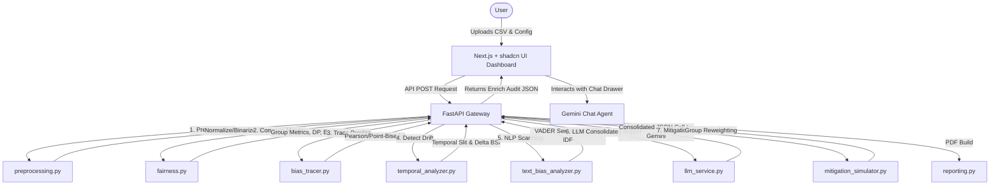

# Bias AI System

The Bias AI System is an enterprise-grade AI Audit System built to detect, trace, and mitigate algorithmic bias in machine learning models and datasets. Combining deterministic statistical engines with Google Gemini LLM reasoning, it generates compliance-grade narrative audits, legal exposure risk mappings, and simulated bias mitigations via an interactive dashboard interface.

---

## 🏛️ System Architecture

The application is structured into a decoupled frontend and backend:



### Request-Response Lifecycle
1. **Upload & Suggestion**: The user uploads a CSV file through [FileUpload.tsx](frontend/components/FileUpload.tsx). The backend automatically infers suitable target, sensitive, time, and text columns using `suggest_column_roles` in [preprocessing.py](backend/app/services/preprocessing.py).
2. **Preprocessing**: The dataset is parsed, missing values are imputed, and target columns are dynamically binarized. Text columns are encoded using sentence embeddings via [text_encoder.py](backend/app/services/text_encoder.py).
3. **Core Fairness Core Metrics**: Deterministic checks compute Demographic Parity, Equalized Odds, Adverse Impact Ratios, and the compound Bias Severity Index (BSI).
4. **Proxy Tracing**: Features correlated with the sensitive attribute are evaluated using Pearson and point-biserial correlations.
5. **Temporal & Text Analyses**: Temporal drift scans check for worsening or improving bias, while TF-IDF and VADER scan unstructured text for language bias.
6. **Gemini Consolidator**: Results are packed into a unified prompt for Gemini 1.5 Flash in [llm_service.py](backend/app/services/llm_service.py) to generate plain-English explanations, audit narratives, legal risk mappings, and 4-step rectification plans in a single pass.
7. **Mitigation Simulation**: Standard baseline model predictions are contrasted against a mitigated pipeline applying group reweighting.
8. **Dashboard Render**: The final enriched JSON payload (matching [analyze-response.json](shared/analyze-response.json)) is displayed in the React dashboard [results/page.tsx](frontend/app/results/page.tsx).

---

## 📊 Core Analytical Modules

The backend logic lies in [backend/app/services](backend/app/services).

### 1. Fairness Computation Engine
Implemented in [fairness.py](backend/app/services/fairness.py), this engine calculates quantitative demographic metrics:
*   **Demographic Parity Difference**: Measures difference in selection rate ($P(\hat{Y}=1 | S=s)$) between groups.
    $$\text{DP Difference} = \max_{s} P(\hat{Y}=1 | S=s) - \min_{s} P(\hat{Y}=1 | S=s)$$
*   **Equalized Odds Difference**: Computes the maximum group-level difference between True Positive Rates (TPR) and False Positive Rates (FPR).
    $$\text{EO Difference} = \max \left( \Big| \text{TPR}_a - \text{TPR}_b \Big|, \Big| \text{FPR}_a - \text{FPR}_b \Big| \right)$$
*   **EEOC 4/5ths Selection Rule (Disparate Impact Ratio)**: The Adverse Impact Ratio (AIR) compares selection rates of the lowest-performing group relative to the highest-performing group:
    $$\text{Adverse Impact Ratio} = \frac{\min_{s} P(\hat{Y}=1 | S=s)}{\max_{s} P(\hat{Y}=1 | S=s)}$$
    An adverse impact ratio $< 0.8$ triggers the EEOC 4/5ths warning (significant evidence of disparate impact).
*   **Bias Severity Index (BSI)**: A normalized composite metric (0 to 100) scoring overall algorithmic bias:
    $$\text{BSI} = 100 \times \left( 0.4 \times |\text{DP Diff}| + 0.4 \times |\text{EO Diff}| + 0.2 \times I_{\text{group}} \right)$$
    Where $I_{\text{group}}$ is the log-scaled group representation imbalance score:
    $$I_{\text{group}} = \min\left(1.0, \frac{\ln(1 + R - 1)}{\ln(10)}\right) \quad \text{where } R = \frac{\max_s N(S=s)}{\min_s N(S=s)}$$
    *BSI Bands:* Low ($<20$), Moderate ($20\text{--}40$), High ($40\text{--}65$), Critical ($\ge 65$).

### 2. Target Variable Normalization
If the dataset lacks pre-computed binary outcomes, [fairness.py](backend/app/services/fairness.py) applies dynamic normalization:
*   **Continuous Targets**: Triggers threshold-based binarization. If no custom threshold is supplied, it defaults to the median: $Y_{\text{bin}} = 1 \text{ if } Y \ge \text{median else } 0$.
*   **Multiclass Targets**: Converts labels to binary one-vs-rest format, selecting the majority class as the positive outcome ($1$) and all other classes as ($0$).
*   **Categorical Targets**: Standardizes labels into binary classes mapped to $0$ and $1$.

### 3. Proxy Discrimination Tracing
In [bias_tracer.py](backend/app/services/bias_tracer.py), the system identifies features that may be inadvertently acting as proxies for protected attributes (e.g., ZIP code proxying race):
*   Calculates correlations between non-sensitive features and the encoded sensitive attribute.
*   **Numeric features**: Employs Pearson/point-biserial correlation.
*   **Low-cardinality categorical features** ($\le 50$ classes): Performs one-hot expansion and computes the maximum absolute correlation among generated dummy columns.
*   **High-cardinality categorical features**: Automatically falls back to Label Encoding for scalar correlation to avoid memory issues.
*   **Optimization**: Caps correlation computation at a representative sample of $20,000$ rows.

### 4. Temporal Drift Detection
The [temporal_analyzer.py](backend/app/services/temporal_analyzer.py) detects shift in bias over time:
1. Parses dates in the time column, sorting the dataset chronologically.
2. Splits the sorted timeline into early and late halves.
3. Computes the BSI score for both halves.
4. Returns the drift delta ($\Delta \text{BSI} = \text{Late BSI} - \text{Early BSI}$).
   *   $\Delta \text{BSI} > 3$: *Worsening bias*
   *   $\Delta \text{BSI} < -3$: *Improving bias*
   *   Otherwise: *Stable bias profile*
5. **Optimization**: Caps each temporal partition at a sample of $5,000$ rows for fast proxy model training.

### 5. NLP Text Bias Scanner
In [text_bias_analyzer.py](backend/app/services/text_bias_analyzer.py), the system scans unstructured columns for semantic discrepancies:
*   **Sentiment Gaps**: Employs VADER Sentiment Analysis to evaluate sentiment polarity score gaps between groups.
*   **Term Association**: Runs TF-IDF vectorization inside sensitive group masks to return key terms correlated with specific demographic cohorts.

### 6. Mitigation Simulation & Group Reweighting
Simulated mitigations run in [mitigation_simulator.py](backend/app/services/mitigation_simulator.py):
*   **Reweighting Math**: In [reweighting.py](backend/app/services/reweighting.py), group reweighting generates sample weights to balance selection frequencies:
    $$W(s, y) = \frac{N(S=s) \times N(Y=y)}{N \times N(S=s, Y=y)}$$
    Where $N(S=s, Y=y)$ is the count of records matching group $s$ with label $y$.
*   **Vectorization**: Computed via optimized pandas dataframe joins rather than row loops.
*   **Caching Strategy**: When evaluating mitigations, the simulator re-uses the pre-computed baseline results (avoiding redundant proxy model training).
*   **Extraction**: Users can download the reweighted CSV dataset directly via `/api/reweighted-csv`.

---

## 🧮 Core Algorithms Deep Dive

The system employs several machine learning, statistical, and natural language processing algorithms:

### 1. Proxy Model Classifier (Logistic Regression Pipeline)
When model predictions are not uploaded by the user, the auditing engine trains a local proxy model to simulate model predictions. This is implemented via a `scikit-learn` pipeline:
*   **Feature Preprocessing**: Built using `ColumnTransformer`. Continuous numeric columns are scaled via `StandardScaler`. Categorical features are encoded using `OneHotEncoder(handle_unknown="ignore", sparse_output=False)`.
*   **Classification Algorithm**: Trains a `LogisticRegression` classifier. It uses the **SAGA optimization solver** (`solver="saga"`) which supports multithreading (`n_jobs=-1`), scales efficiently to larger datasets, and converges reliably with a tolerance parameter set to `1e-3`.
*   **Data Partitioning**: The dataset is split into a **70% training set** and a **30% test set** using `train_test_split` with target stratification to preserve minority class ratios.
*   **Performance Optimization**: To keep response times low, training rows are capped at a stratified random sample of $10,000$ rows.

### 2. Group Reweighting Mitigation (Kamiran & Calders)
To simulate bias mitigation, the system applies **group reweighting** (Kamiran and Calders, 2012). This algorithm assigns weights to individual samples in the dataset without modifying feature values:
*   **Weight Calculation**: Computed vectorially by calculating the joint probability distribution of the sensitive attribute $S$ and binary target $Y$:
    $$W_{S,Y} = \frac{N(S) \times N(Y)}{N \times N(S,Y)}$$
*   **Downstream Effect**: When sample weights are applied, they adjust the demographic selection rates ($P(\hat{Y}=1 | S=s)$) to align with parity standards, creating a balanced dataset profile that can be downloaded as a CSV.

### 3. Proxy Feature Correlation Analysis
In tracing proxy attributes, the system measures statistical association strengths:
*   **Pearson & Point-Biserial Coefficients**: Calculates the linear correlation between features and the protected attribute. Continuous/numeric variables undergo point-biserial correlation mapping.
*   **Categorical Dummy Correlation**: Categorical features are one-hot encoded, and the maximum absolute correlation among all generated dummies is assigned to represents the feature's proxy strength.
*   **Row Sampling**: Limited to a random sample of $20,000$ rows for correlation computation performance.

### 4. Text Bias Lexicons & Vectorization
For free-form text auditing:
*   **Sentiment Intensity Analysis**: Employs the **VADER (Valence Aware Dictionary and sEntiment Reasoner)** rule-based sentiment model. VADER uses a grammatical and lexical sentiment lexicon specifically tuned for social/colloquial text to calculate a normalized compound sentiment score between $-1.0$ (most negative) and $+1.0$ (most positive).
*   **Term Extraction (TF-IDF)**: Extracts group-associated terms using **Term Frequency-Inverse Document Frequency** vectorization. The TF-IDF matrix (using English stop-word filtering and a vocabulary size limit of 2,000) isolates words with high statistical prominence unique to specific protected groups.

---

## 🤖 Google Gemini SDK Integration

All LLM logic is managed by [llm_service.py](backend/app/services/llm_service.py).

### SDK Features & Single-Pass Optimization
*   **Structured JSON Output**: Uses the `google-genai` native SDK client to request structured JSON responses by setting `response_mime_type="application/json"`.
*   **Token & Time Optimization**: Consolidates multiple downstream LLM requirements—intent recognition, legal context mapping, executive summaries, per-proxy impact analysis, counterfactuals, and 4-step rectification checklists—into a **single, unified request** to Gemini 1.5 Flash. This reduces roundtrip latency.
*   **OpenAI SDK Gateway Fallback**: If custom API keys or proxy gateways (like OpenAI/Groq custom base URLs) are passed via `LLM_BASE_URL` or `LLM_API_KEY`, the service automatically falls back to an OpenAI SDK client instantiation.
*   **Graceful Parsers**: Includes custom JSON repair routines to handle bracket truncation or unescaped strings during quota-limited responses.

### Legal Compliance Mapping & Domain Classification
Gemini infers the industry domain and matches it to standard statutory frameworks:
*   **Hiring**: Maps to **EEOC Title VII (Uniform Guidelines on Employee Selection Procedures)**.
*   **Credit/Finance**: Maps to the **Fair Credit Reporting Act (FCRA)** or **Equal Credit Opportunity Act (ECOA)**.
*   **Housing**: Maps to the **Fair Housing Act (FHA)**.
*   **Healthcare**: Maps to the **Affordable Care Act (ACA) Section 1557**.

---

## 🔌 API Documentation

### 1. File Upload Column Suggestion
Provides immediate configuration suggestions after selecting a file.

*   **Endpoint**: `POST /api/column-suggestions`
*   **Payload**: Multipart form-data with key `file` (CSV).
*   **Response Schema**:
    ```json
    {
      "columns": ["age", "income", "gender", "loan_status", "signup_date"],
      "target": "loan_status",
      "sensitive": "gender",
      "prediction_column": null,
      "time_column": "signup_date",
      "method": "heuristic_analysis",
      "notes": ["Detected demographic distributions aligned with sensitive metrics."]
    }
    ```

### 2. Full Dataset Bias Audit
Executes core fairness metrics, proxy analysis, drift checks, NLP scanning, and calls the LLM service.

*   **Endpoint**: `POST /api/analyze`
*   **Payload**: Multipart form-data:
    *   `file`: CSV file (required)
    *   `target`: Target variable column name (required)
    *   `sensitive`: Protected attribute column name (required)
    *   `prediction_column`: Model prediction column name (optional)
    *   `time_column`: Chronological column name (optional)
    *   `text_columns`: Comma-separated list of unstructured columns (optional)
    *   `target_binarization_threshold`: Median override float (optional)
    *   `weight_column`: Sample weight column name (optional)
    *   `query`: Contextual search or audit goal text (optional, default: `"check bias"`)
*   **Response**: Fully matches the JSON schema defined in [analyze-response.json](shared/analyze-response.json).

### 3. Mitigation Reweighting Generator
Applies group reweighting adjustments to the user's dataset and streams the resulting CSV directly back to the client.

*   **Endpoint**: `POST /api/reweighted-csv`
*   **Payload**: Multipart form-data:
    *   `file`: Original CSV file (required)
    *   `sensitive`: Protected attribute column name (required)
    *   `target`: Target variable column (required)
    *   `target_binarization_threshold`: Custom binarization float (optional)
*   **Response**: `text/csv` attachment file stream.

### 4. Interactive Agent Chat
Allows conversational evaluation of the generated audit certificate.

*   **Endpoint**: `POST /api/agent`
*   **Payload**:
    ```json
    {
      "message": "Explain how gender correlates with income proxy variables in my dataset.",
      "history": [
        { "role": "user", "content": "Start conversation." },
        { "role": "assistant", "content": "Ready to discuss findings." }
      ],
      "audit_report": { ... }
    }
    ```
*   **Response**:
    ```json
    {
      "response": "Based on the proxy tracing, features like 'occupation' show a moderate positive correlation (0.34) with your sensitive attribute..."
    }
    ```

### 5. Intersectional Analysis
Performs bias audits combining two sensitive dimensions (e.g., gender and race combined).

*   **Endpoint**: `POST /api/intersectional`
*   **Payload**: Multipart form-data:
    *   `file`: CSV file (required)
    *   `target`: Target column (required)
    *   `sensitive_a`: Protected feature A (required)
    *   `sensitive_b`: Protected feature B (required)
*   **Response**: Returns the standard `AnalyzeResponse` matching [analyze-response.json](shared/analyze-response.json) for the combined sensitive dimension `sensitive_a|sensitive_b`.

---

## 🛠️ Local Development & Setup

### Environment Variables
Configure local keys in [backend/.env](backend/.env) (refer to [backend/.env.example](backend/.env.example)):
```bash
GEMINI_API_KEY=your_gemini_key_here
LLM_MODEL=gemini-1.5-flash
FRONTEND_ORIGIN=http://localhost:3000
```
Configure local variables in [frontend/.env.local](frontend/.env.local) (refer to [frontend/.env.local.example](frontend/.env.local.example)):
```bash
NEXT_PUBLIC_API_BASE_URL=http://localhost:8000/api
```

### Backend Execution
1. Navigate to the backend directory:
   ```bash
   cd backend
   ```
2. Create and activate a Python virtual environment:
   ```bash
   python -m venv .venv
   source .venv/bin/activate
   ```
3. Install package dependencies:
   ```bash
   pip install -r requirements.txt
   ```
4. Boot the server using `uvicorn`:
   ```bash
   uvicorn app.main:app --reload --port 8000
   ```

### Frontend Execution
1. Navigate to the frontend directory:
   ```bash
   cd frontend
   ```
2. Install Node dependencies:
   ```bash
   npm install
   ```
3. Launch the Next.js development server:
   ```bash
   npm run dev
   ```
4. Access the client at [http://localhost:3000](http://localhost:3000).
